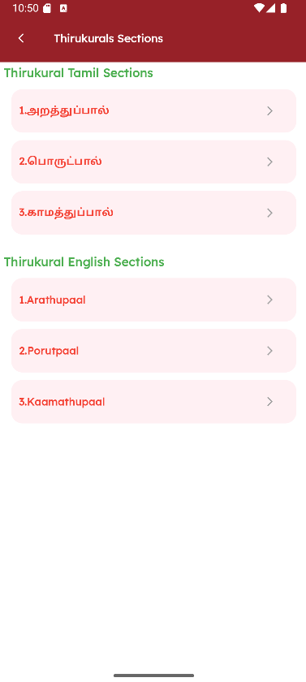

Thirukural is a classic Tamil sangam literature consisting of **1330 kurals** (couplets) divided into **133 chapters** and **3 sections**, authored by the great Tamil poet **Thiruvalluvar**. This package provides beautiful, ready-to-use widgets to display Kurals in various ways - perfect for apps focused on Tamil culture, literature, or daily wisdom!

---

## ✨ Features

- 📅 **Kural of the Day** - Display daily wisdom based on the date
- 🔢 **Kural by Number** - Fetch any specific Kural (1-1330)
- 📚 **All Kurals** - Browse all 1330 Kurals with lazy loading
- 📊 **Kurals in Range** - Display Kurals within a number range
- 📁 **Browse by Section** - Navigate through the 3 main sections (Paals)
- 🇹🇲 **Tamil Chapter Names** - Browse all 133 chapters in Tamil
- 🇬🇧 **English Chapter Names** - Browse all 133 chapters in English
- 📱 **Responsive Design** - Works on mobile, tablet, and desktop
- 🎨 **Beautiful UI** - Ready-to-use widgets with elegant design
- 🔄 **Pull-to-Refresh** - Refresh content easily
- ⚡ **Self-Contained** - No additional setup required!

---

## 📦 Installation

Add this to your `pubspec.yaml`:

```yaml
dependencies:
  flutter_thirukural: ^1.0.0
```

Then run:

```bash
flutter pub get
```

---

## 🚀 Quick Start

```dart
import 'package:flutter_thirukural/flutter_thirukural.dart';
```

That's it! All widgets are self-contained and ready to use. No additional setup, providers, or wrappers needed!

---

## 📖 Usage Examples

### 1. Thirukural of the Day

Display the Kural of the Day for any date:

```dart
import 'package:flutter_thirukural/flutter_thirukural.dart';
import 'package:intl/intl.dart';

// Today's Kural
ThirukuralOfTheDay(
  date: DateFormat('dd-MM-yyyy').format(DateTime.now()),
)

// Specific date
ThirukuralOfTheDay(date: '04-01-2026')
```

> **Note:** Date format must be `dd-MM-yyyy` (e.g., '04-01-2026' for January 4, 2026)

### 2. Kural by Number

Display a specific Kural:

```dart
// Display Kural #1
ThirukuralByNumber(kuralNumber: 1)

// Display Kural #153
ThirukuralByNumber(kuralNumber: 153)

// Random Kural
import 'dart:math';
ThirukuralByNumber(kuralNumber: Random().nextInt(1330) + 1)
```

### 3. All Thirukurals

Browse all 1330 Kurals:

```dart
AllThirukurals()
```

### 4. Kurals in a Range

Display Kurals within a specific range:

```dart
// First 10 Kurals
ThirukuralsInRange(from: 1, to: 10)

// Chapter 5 (Kurals 41-50)
ThirukuralsInRange(from: 41, to: 50)
```

### 5. Browse by Section Names

Explore the three main sections:

```dart
ThirukuralBySectionNames()
```

The three sections are:
- **அறத்துப்பால் (Arathupaal)** - The Book of Virtue (Kurals 1-380)
- **பொருட்பால் (Porutpaal)** - The Book of Wealth (Kurals 381-1080)
- **காமத்துப்பால் (Kaamathupaal)** - The Book of Love (Kurals 1081-1330)

### 6. Browse by Tamil Chapter Names

Browse all 133 chapters in Tamil:

```dart
ThirukuralByTamilChapterNames()
```

### 7. Browse by English Chapter Names

Browse all 133 chapters in English:

```dart
ThirukuralByEnglishChapterNames()
```

---

## 🌐 Web Routes

For web applications, the package provides predefined route constants for proper URL-based navigation:

```dart
import 'package:flutter_thirukural/flutter_thirukural.dart';

// Available routes
ThirukuralRoutes.allKurals        // '/thirukural/all'
ThirukuralRoutes.kuralOfTheDay    // '/thirukural/kural-of-the-day'
ThirukuralRoutes.kuralByNumber    // '/thirukural/kural'
ThirukuralRoutes.kuralsInRange    // '/thirukural/range'
ThirukuralRoutes.sectionNames     // '/thirukural/sections'
ThirukuralRoutes.tamilChapters    // '/thirukural/tamil-chapters'
ThirukuralRoutes.englishChapters  // '/thirukural/english-chapters'
```

### Example Web Route Setup

```dart
MaterialApp(
  onGenerateRoute: (settings) {
    final uri = Uri.parse(settings.name ?? '/');
    
    switch (uri.path) {
      case ThirukuralRoutes.allKurals:
        return MaterialPageRoute(builder: (_) => const AllThirukurals());
        
      case ThirukuralRoutes.kuralByNumber:
        final number = int.tryParse(uri.queryParameters['number'] ?? '1') ?? 1;
        return MaterialPageRoute(
          builder: (_) => ThirukuralByNumber(kuralNumber: number),
        );
        
      // ... add other routes
    }
  },
)
```

---

## 🎯 Complete Example

Here's a full example showing how to integrate Thirukural into your app:

```dart
import 'package:flutter/material.dart';
import 'package:flutter_thirukural/flutter_thirukural.dart';
import 'package:intl/intl.dart';

void main() {
  runApp(const MyApp());
}

class MyApp extends StatelessWidget {
  const MyApp({super.key});

  @override
  Widget build(BuildContext context) {
    return MaterialApp(
      title: 'Thirukural Demo',
      theme: ThemeData(
        colorScheme: ColorScheme.fromSeed(seedColor: Colors.deepPurple),
        useMaterial3: true,
      ),
      home: const HomePage(),
    );
  }
}

class HomePage extends StatelessWidget {
  const HomePage({super.key});

  @override
  Widget build(BuildContext context) {
    return Scaffold(
      appBar: AppBar(
        title: const Text('Thirukural Demo'),
        backgroundColor: Theme.of(context).colorScheme.inversePrimary,
      ),
      body: ListView(
        padding: const EdgeInsets.all(16.0),
        children: [
          _buildTile(
            context,
            title: 'Kural of the Day',
            subtitle: 'Today\'s wisdom',
            onTap: () => Navigator.push(
              context,
              MaterialPageRoute(
                builder: (context) => ThirukuralOfTheDay(
                  date: DateFormat('dd-MM-yyyy').format(DateTime.now()),
                ),
              ),
            ),
          ),
          _buildTile(
            context,
            title: 'Random Kural',
            subtitle: 'Get inspired',
            onTap: () => Navigator.push(
              context,
              MaterialPageRoute(
                builder: (context) => ThirukuralByNumber(
                  kuralNumber: DateTime.now().millisecond % 1330 + 1,
                ),
              ),
            ),
          ),
          _buildTile(
            context,
            title: 'All Kurals',
            subtitle: 'Browse all 1330 Kurals',
            onTap: () => Navigator.push(
              context,
              MaterialPageRoute(
                builder: (context) => const AllThirukurals(),
              ),
            ),
          ),
          _buildTile(
            context,
            title: 'Browse by Section',
            subtitle: 'Explore the 3 main sections',
            onTap: () => Navigator.push(
              context,
              MaterialPageRoute(
                builder: (context) => const ThirukuralBySectionNames(),
              ),
            ),
          ),
          _buildTile(
            context,
            title: 'Tamil Chapters',
            subtitle: 'Browse by Tamil chapter names',
            onTap: () => Navigator.push(
              context,
              MaterialPageRoute(
                builder: (context) => const ThirukuralByTamilChapterNames(),
              ),
            ),
          ),
          _buildTile(
            context,
            title: 'English Chapters',
            subtitle: 'Browse by English chapter names',
            onTap: () => Navigator.push(
              context,
              MaterialPageRoute(
                builder: (context) => const ThirukuralByEnglishChapterNames(),
              ),
            ),
          ),
        ],
      ),
    );
  }

  Widget _buildTile(
    BuildContext context, {
    required String title,
    required String subtitle,
    required VoidCallback onTap,
  }) {
    return Card(
      margin: const EdgeInsets.only(bottom: 12),
      child: ListTile(
        title: Text(title),
        subtitle: Text(subtitle),
        trailing: const Icon(Icons.arrow_forward_ios),
        onTap: onTap,
      ),
    );
  }
}
```

---

## 🖼️ Screenshots

| Home Screen | All Thirukurals | Kural of the Day |
|:-----------:|:---------------:|:----------------:|
|  |  |  |

| Kurals in Range | Kural by Number | Sections |
|:---------------:|:---------------:|:--------:|
|  |  |  |

| Tamil Chapters | English Chapters |
|:--------------:|:----------------:|
|  |  |

---

## 📋 API Reference

### ThirukuralOfTheDay

| Parameter | Type | Required | Description |
|-----------|------|----------|-------------|
| `date` | `String?` | Yes | Date in `dd-MM-yyyy` format |

### ThirukuralByNumber

| Parameter | Type | Required | Description |
|-----------|------|----------|-------------|
| `kuralNumber` | `int?` | Yes | Kural number (1-1330) |

### ThirukuralsInRange

| Parameter | Type | Required | Description |
|-----------|------|----------|-------------|
| `from` | `int?` | Yes | Start of range (1-1329) |
| `to` | `int?` | Yes | End of range (2-1330) |

### AllThirukurals, ThirukuralBySectionNames, ThirukuralByTamilChapterNames, ThirukuralByEnglishChapterNames

No parameters required. Just instantiate and use!

---

## 🌐 Requirements

- **Flutter**: >= 3.27.0
- **Dart**: >= 3.6.0
- **Internet Connection**: Required to fetch Kural data from the API

---

## ⚠️ Troubleshooting

### Widget shows loading indefinitely

This could happen if:
1. **No internet connection** - The package needs internet to fetch data
2. **API server cold start** - The backend is hosted on a free tier and may take up to 30 seconds to wake up on first request. Just wait a moment and try again.

### Images not loading

Make sure you're using the latest version of the package. Asset paths have been fixed in v1.0.0+2.

### Back button not working

This has been fixed in v1.0.0+2. Update to the latest version.

---

## 🤝 Contributing

Contributions are welcome! Here's how you can help:

1. Fork this repo
2. Create a new branch (`git checkout -b feature/amazing-feature`)
3. Commit your changes (`git commit -m 'Add amazing feature'`)
4. Push to the branch (`git push origin feature/amazing-feature`)
5. Open a Pull Request

---

## 🐞 Reporting Issues

If you encounter any issues while using `flutter_thirukural`, please:

1. [Create an issue on GitHub](https://github.com/SanjayPrasathG/flutter_thirukural/issues)
2. Or email me directly at: sanjayprasathg24cse@gmail.com

Please include:
- Flutter version (`flutter --version`)
- Package version
- Error message or screenshot
- Steps to reproduce

---

## ☕ Support

If this package helped you, consider supporting my work:

[](https://buymeacoffee.com/sanjayprasathg)

---

## 👤 Maintainer

**Sanjay Prasath Ganesh**

- GitHub: [@SanjayPrasathG](https://github.com/SanjayPrasathG)
- LinkedIn: [Sanjay Prasath Ganesh](https://www.linkedin.com/in/sanjay-prasath-ganesh/)
- Email: sanjayprasathg24cse@gmail.com

---

## 📄 License

This project is licensed under the MIT License — see the [LICENSE](LICENSE) file for details.

---

## 🙏 Acknowledgments

- **Thiruvalluvar** - The great Tamil poet who authored Thirukural
- The Tamil literary community for preserving this timeless wisdom
- All contributors who help improve this package

---

<p align="center">
  Made with ❤️ for Tamil literature enthusiasts
</p>
